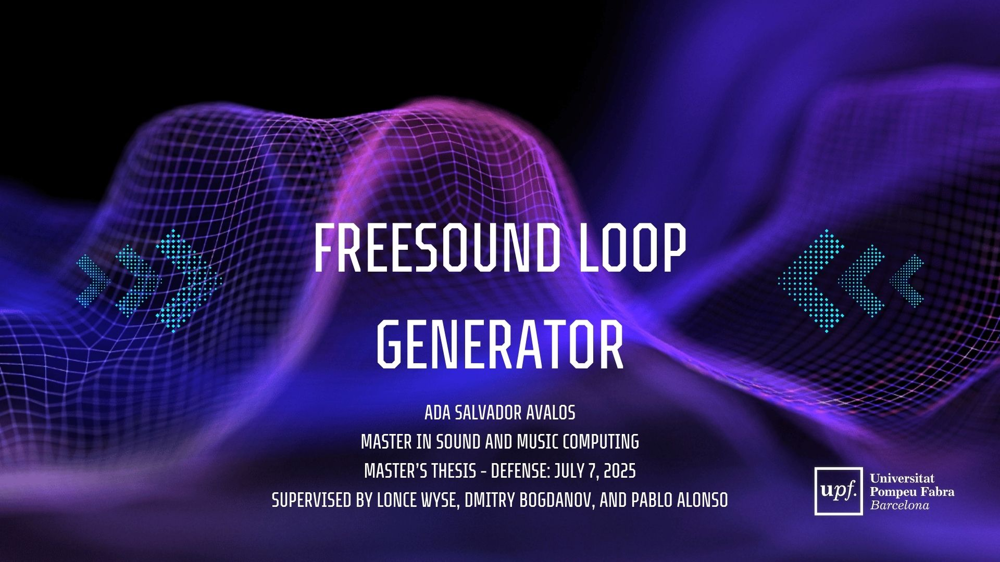

# Freesound Loop Generator
This repository contains the code developed for my **Master Thesis** in the *Master in Sound and Music Computing* program at **Universitat Pompeu Fabra**.  

This project explores creative sound generation with neural networks, foucsing on the synthesis of new audio loops through latent space manipulation. It is built on the [Freesound Loop Dataset](https://zenodo.org/records/3967852) and uses the [RAVE autoencoder model](https://github.com/acids-ircam/RAVE) to learn compact reprentations of audio.

Key features:
- **Preprocessing pipeline**: Tempo normalization, beat and downbeat alignment to ensure rhythmic and structural consistency.
- **Neural autoencoder (RAVE)**: Trains on audio loops to compress and reconstruc them with high-fidelity.
- **Latent space synthesis**: Generate new loops by interpolating between different examples, blending styles and creating smooth transitions.
- **Genre guidance**: Classification-driven selection to explore stylistic variations.
- **Real-time control**: Manipulate latent dimensions interactively for live performance or dynamic sound design.

This repository contains the full preprocessing pipeline, exploratory dataset analysis, training setup, and inference scripts for reproducible experimentation and creative loop generation. 

## Demo Video
Watch the introduction and demo of the inference scripts.

[](https://www.youtube.com/watch?v=28W14f0ROkA)


## Installation
Create an environment with the necessary dependencies. Python 3.10 is recommended, especially for the preprocessing step.

Using pip: 
```
pip install -r requirements.txt
```

Or, if using conda:
```
conda env update --file rave_preprocess_env.yml --prune
conda activate rave_preprocess_env
```

## Preprocessing

1. Download the dataset from the web: [Freesound Loop Dataset](https://zenodo.org/records/3967852)  **or** run the retrieval script, and unzip `FSL10K.zip`:

    ````
    python retrieve_dataset.py
    ````

2. Run the preprocessing script:

    ````
    python preprocess.py --input_dir FSL10K/audio/wav --output_dir output_preprocess_rave --metadata FSL10K/metadata.json --filter_by_bpm --min_bpm 110 --max_bpm 130 --shuffle
    ````
    This generates a subset of audio files with uniform tempo and proper formating for model training. 

3. Prepare the subset for training by running the cells in `data_preparation.ipynb`.


## Training

To train the model, follow the official IRCAM [Tutorial: Training RAVE models on custom data](https://forum.ircam.fr/article/detail/training-rave-models-on-custom-data/).

## Inference

The inference pipeline was developed in **MSP/MAX 8**.  
To use it, make sure to install the `nn~` external and load the desired model checkpoint.  
If you want, you can use the provided checkpoint at:

`model_checkpoint/adaloops_streaming.ts`
