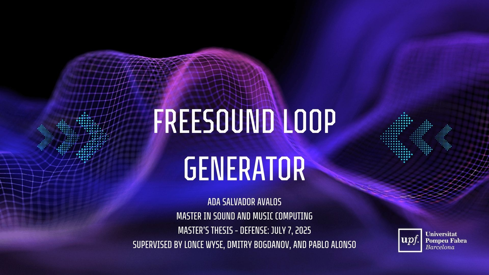

# Freesound Loop Generator
This repository contains the code developed for my **Master Thesis** in the *Master in Sound and Music Computing* program at **Universitat Pompeu Fabra**.  

This project explores creative sound generation with neural networks, focusing on the synthesis of new audio loops through latent space manipulation. It is built on the [Freesound Loop Dataset](https://zenodo.org/records/3967852) and uses the [RAVE autoencoder model](https://github.com/acids-ircam/RAVE) to learn compact representations of audio.

Key features:
- **Preprocessing pipeline**: Tempo normalization, beat and downbeat alignment to ensure rhythmic and structural consistency.
- **Realtime Audio Variational AutoEncoder (RAVE)**: Trains on audio loops to compress and reconstruct them with high-fidelity.
- **Latent space synthesis**: Generate new loops by interpolating between different examples, blending styles and creating smooth transitions.
- **Genre guidance**: Classification-driven selection to explore stylistic variations.
- **Real-time control**: Manipulate latent dimensions interactively for live performance or dynamic sound design.

This repository contains the full preprocessing pipeline, exploratory dataset analysis, training setup, and inference scripts for reproducible experimentation and creative loop generation. 

## Demo Video
Watch the introduction and demonstration of the inference scripts.

[](https://www.youtube.com/watch?v=28W14f0ROkA)


## Installation
Create an environment with the necessary dependencies. Python 3.10 is recommended.

Using pip: 
```
pip install -r requirements.txt
```

Or, if using conda:
```
conda env create -f flg_env.yml
conda activate flg_env
```

## Usage

### Download Dataset 
To download the dataset from the [Freesound Loop Dataset](https://zenodo.org/records/3967852) and unzip `FSL10K.zip`, **or** run the retrieval script:

    ````
    python retrieve_dataset.py
    ````

### Preprocessing
1. To preprocess de audio files from a dataset:
    ```
    cd preprocessing

    python preprocess.py --input_dir <INPUT_DIR> --metadata <METADATA_FILE> [options]
    ```

    **Required arguments:**
    - `--input_dir` <INPUT_DIR>: Directory containing WAV files.
    - `--metadata` <METADATA_FILE>: Path to metadata.json file.

    **Optional Arguments:**
    - `--output_dir` <OUTPUT_DIR>: Directory for processed files (default: output_dir).
    - `--num_files` <N>: Number of files to process (default: all).
    - `--preserve_bpm`: Preserve original BPM instead of normalizing.
    - `--min_bpm` <FLOAT>: Minimum BPM for filtering (default: 120).
    - `--max_bpm` <FLOAT>: Maximum BPM for filtering (default: 130).
    - `--filter_by_bpm`: Filter files by BPM range.
    - `--shuffle`: Randomly shuffle files before processing.
    - `--seed` <INT>: Random seed for shuffling (default: 42)

    **Beat-alignment options:**
    - `--align_beats`: Align audio to start with downbeats. (default)
    - `--target_beats` <INT>: Number of beats in the output audio (default: 32).
    - `--confidence_threshold` <FLOAT>: Minimum confidence for beat alignment (default: 0.3).

    #### Examples

    For this project, the pretrained model in `model_checkpoint/` was used. The dataset was filtered by BPM, keeping only audio files between 110 and 130 BPM, and a target BPM of 120 was applied to make all files consistent:

    ````
    python preprocess.py --input_dir FSL10K/audio/wav --output_dir output_preprocess_rave --metadata FSL10K/metadata.json --filter_by_bpm --min_bpm 110 --max_bpm 130 --shuffle
    ````

    To preserve the original BPM and process only 50 shuffled files from the dataset:

    ````
    python preprocess.py --input_dir FSL10K/audio/wav --output_dir output_preprocess_rave --metadata FSL10K/metadata.json --preserve_bpm --num_files 50 --shuffle
    ````

2. Prepare the subset for training by running the cells in `data_preparation.ipynb`.


### Training

To train the RAVE model on your dataset, first set up your Python environment following the official IRCAM tutorial: [Training RAVE models on custom data](https://forum.ircam.fr/article/detail/training-rave-models-on-custom-data/).

Once your environment is ready, you can use the provided training script:

```
cd training

# Make the script executable
chmod +x train.sh

# Run the training, preprocessing, and export workflow
./train.sh
```
The `train.sh` script automates the workflow for training a RAVE (Realtime Audio Variational AutoEncoder) model. It performs three main steps:

1. **Preprocessing.**
Converts the input audio files to a format suitable for RAVE, including multi-band decomposition and optional channel selection.

2. **Training.**
Runs a full 2-million-step training pipeline:

    - **Phase 1 (VAE, first 1M steps)**: Learns a compact latent representation of the audio.

    - **Phase 2 (Adversarial fine-tuning, next 1M steps)**: Freezes the encoder and trains the decoder adversarially to improve synthesis realism. Additional configurations such as noise and causal are applied to enhance real-time performance and audio quality.

3. **Export.**
Exports the trained model as a TorchScript file with streaming-enabled convolutions, ready for real-time audio generation.

#### Customization

You can edit the following variables at the top of `train.sh` to adapt it to your dataset and system:
- `INPUT_PATH`: Path to your raw audio files.
- `PREPROCESS_PATH`: Directory for preprocessed audio.
- `RUN_NAME`: Name of the training run.
- `OUT_PATH`: Directory to store training outputs.
- `CHANNELS`: Number of audio channels.
- `MAX_STEPS`: Total training steps (default: 2,000,000).
- `TRAIN_CONFIGS`: Additional training configurations (noise, causal, etc.).
- `EXPORT_PATH`: Path to save the final model.

### Inference

The inference pipeline was developed in **MSP/MAX 8**.  
To run it, ensure that the [`nn~`](https://forum.ircam.fr/projects/detail/nn/) external is installed. This project was developed with release [1.5.3](https://github.com/acids-ircam/nn_tilde/releases/tag/v1.5.3).

After installation, load your desired model checkpoint.

For convenience, a pre-trained checkpoint is included at:  
`model_checkpoint/adaloops_streaming.ts`  
Audio files prepared for its usage are available at:  
`inference/audios`

Three different Max patches were developed. Each contains:  
- The `gen~` object with a linear interpolation patch between the `encode` and `decode` objects.
- Dynamic modulations, including sawtooth, ramp, sine, and square waves.
- BPM and pitch manipulations applied after decoding.

The patches in the `inference` folder are:  
- `inference_simple.maxpat`: Uses a single morphing ratio applied to all interpolated dimensions.  
- `inference_separate_morphratios.maxpat`: Allows independent morphing ratios for each interpolated dimension.  
- `inference_tempofirst.maxpat`: Applies tempo and pitch manipulations **before** encoding instead of after decoding, allowing observation of how the pretrained model encodes tempo and pitch information differently.

